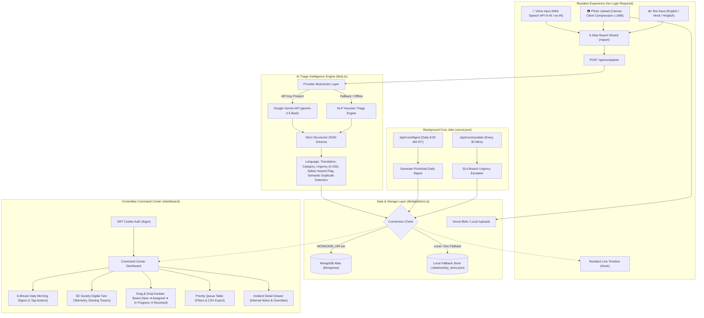

# SocietyPulse — AI Complaint Triage for Housing Societies

[](LICENSE)
[](https://nextjs.org/)
[](https://react.dev/)
[](https://docs.pmnd.rs/react-three-fiber)
[](https://tailwindcss.com/)

> **Quiet the WhatsApp complaint chaos.** Transform unstructured resident messages in **English, Hindi, or Hinglish** into an actionable **5-minute daily digest** for housing society managing committees.

---

## 🏢 System Architecture



---

## ✨ Key Features

1. **Multilingual Reporting (English, Hindi, Hinglish)**:
   - Voice input with animated waveform via **Web Speech API** (`hi-IN` and `en-IN` toggle).
   - Text reporting accepts expressions like *"Lift B subah se band hai"*, *"Pani nahi aa raha"*, or *"Corridor kachra nahi uthaya"*.
   - Photo attachment with client-side canvas compression down to $\le 1\text{ MB}$.
2. **Autonomous AI Triage**:
   - Classifies issues into **8 core categories**: *Water, Lift, Parking, Noise, Cleaning, Electrical, Security, Other*.
   - Assigns objective **Urgency Scores (0–100)** and flags immediate **Safety Risks** (sparking wire, elevator impact, water contamination).
   - **Semantic Duplicate Detection**: Identifies matching issues in the same wing/category, links them, and increments `reportCount` to elevate parent urgency automatically.
   - Provider abstraction behind `lib/ai.ts` with zero-failure heuristic fallback.
3. **Resident Live Tracking (`/track`)**:
   - Look up complaints by Complaint ID (e.g. `SP-2026-0042`) and Flat Number.
   - Vertical animated timeline with committee timestamps and contractor updates.
   - Resident follow-up comments and 1-tap **"Resolved / Not Resolved"** confirmation (reopens issue automatically if unsatisfied).
4. **Committee Command Center (`/dashboard`)**:
   - **Today's 5-Minute AI Digest**: Counts (*3 urgent, 5 new, 2 overdue, 4 duplicates merged*), 1-line English summaries, and 1-tap actions (*Assign / Start / Resolve*).
   - **Interactive 3D Society Map**: Renders low-poly residential towers glowing Red / Amber / Green based on live severity; click any tower to filter issues. Includes a 2D mode toggle for low-power devices.
   - **Kanban Board**: Drag & drop across `New` $\rightarrow$ `Assigned` $\rightarrow$ `In Progress` $\rightarrow$ `Resolved`.
   - **Priority Queue Table**: Multi-column sorting, category/status/urgency/wing filters, and bulk actions.
   - **Monthly Meeting CSV Export**: 1-click download of all formatted committee records.
5. **Admin Portal (`/admin`)**:
   - Configure SLA resolution hours per urgency tier (Critical: 2h, High: 6h, Medium: 24h, Low: 72h).
   - Manage committee credentials and roles (`admin`, `member`).
   - Trigger on-demand SLA escalation tests.

---

## 🛠️ Tech Stack

| Layer | Technologies |
|---|---|
| **Framework** | Next.js 16+ (App Router), TypeScript, React 19 |
| **Styling & Motion** | Tailwind CSS v4, Framer Motion, Lucide Icons |
| **3D Graphics** | Three.js via `@react-three/fiber` & `@react-three/drei` |
| **Database** | MongoDB Atlas + Mongoose (with local persistence fallback) |
| **AI Intelligence** | Google Gemini API (`@google/genai`) + Heuristic NLP fallback |
| **Authentication** | JWT httpOnly secure cookies with bcrypt password hashing |
| **Media Storage** | Vercel Blob (with local `/public/uploads` fallback) |
| **Data Visualization** | Recharts (bar, trend line, and hotspot metrics) |
| **Validation** | Zod schema validation on every route |

---

## 🚀 Quick Start (Local Setup)

The application is completely zero-friction and runnable immediately:

```bash
# 1. Clone the repository
git clone https://github.com/your-username/society-pulse.git
cd society-pulse

# 2. Install dependencies
npm install

# 3. Populate database with realistic seed data
npm run seed

# 4. Start local development server
npm run dev
```

Open `http://localhost:3000` in your browser.

### Default Committee Logins
| Role | Email | Password |
|---|---|---|
| **President / Admin** | `admin@society.org` | `admin123` |
| **Secretary / Member** | `secretary@society.org` | `member123` |
| **Treasurer / Member** | `treasurer@society.org` | `member123` |

*(1-Tap demo buttons are also provided directly on `/login`)*

---

## 🧪 Testing & Verification Scripts

```bash
# Test AI Triage across 10 Hinglish samples
npm run test:triage

# Run full 10-step end-to-end system verification
npm run verify:e2e
```

---

## 🌐 MongoDB Atlas Setup (Free M0 Cluster)

To connect SocietyPulse to a hosted cloud MongoDB database:

1. Sign up for a free account at [mongodb.com/cloud/atlas](https://www.mongodb.com/cloud/atlas).
2. Create a new project and select **Free Shared M0 Cluster**.
3. Under **Security → Network Access**, add IP address `0.0.0.0/0` (Allow Access from Anywhere) so Vercel serverless functions can connect.
4. Under **Security → Database Access**, create a user (e.g. `societypulse_user`) with read/write permissions.
5. In **Database Deployments**, click **Connect → Drivers → Node.js** and copy your connection string:
   ```text
   mongodb+srv://<username>:<password>@cluster0.abcde.mongodb.net/societypulse?retryWrites=true&w=majority
   ```
6. Add this URI to your `.env.local` or Vercel environment variables:
   ```bash
   MONGODB_URI=mongodb+srv://<username>:<password>@cluster0.abcde.mongodb.net/societypulse?retryWrites=true&w=majority
   ```
7. Re-run `npm run seed` to populate your Atlas collections.

---

## 🔐 Environment Variables

| Variable | Description | Default / Example |
|---|---|---|
| `MONGODB_URI` | MongoDB Atlas connection string | `mongodb+srv://...` (or blank for local fallback) |
| `GEMINI_API_KEY` | Google Gemini API Key from Google AI Studio | `AIzaSy...` (or blank for heuristic engine) |
| `NEXTAUTH_SECRET` | Secret key used to sign JWT session cookies | `random-32-char-string` |
| `NEXTAUTH_URL` | Base canonical application URL | `http://localhost:3000` |
| `BLOB_READ_WRITE_TOKEN` | Vercel Blob access token for cloud photo storage | `vercel_blob_rw_...` (or blank for `/uploads`) |
| `CRON_SECRET` | Authorization secret for `/api/cron/*` routes | `local-cron-secret-123` |

---

## ☁️ Deployment Guide (Vercel)

1. **Push to GitHub**:
   ```bash
   git add .
   git commit -m "feat: complete SocietyPulse application"
   git push origin main
   ```
2. **Import into Vercel**:
   - Go to [vercel.com](https://vercel.com) and click **"Add New Project"**.
   - Select your GitHub repository.
3. **Configure Environment Variables in Vercel**:
   - `MONGODB_URI`
   - `GEMINI_API_KEY`
   - `NEXTAUTH_SECRET`
   - `NEXTAUTH_URL` (set to your Vercel URL, e.g. `https://society-pulse.vercel.app`)
   - `CRON_SECRET`
4. **Deploy**:
   - Click **Deploy**. Vercel will build and deploy the Next.js App Router app.
   - Vercel automatically detects `vercel.json` and schedules the crons:
     - `/api/cron/digest` at `08:00 AM IST` (`30 2 * * *` UTC)
     - `/api/cron/escalate` every 30 minutes (`*/30 * * * *`)
5. **Seed Production Database**:
   - Run `npm run seed` locally with the production `MONGODB_URI` set in `.env.local` to populate initial users and baseline complaints.

---

## 📄 License
This project is licensed under the [MIT License](LICENSE).
